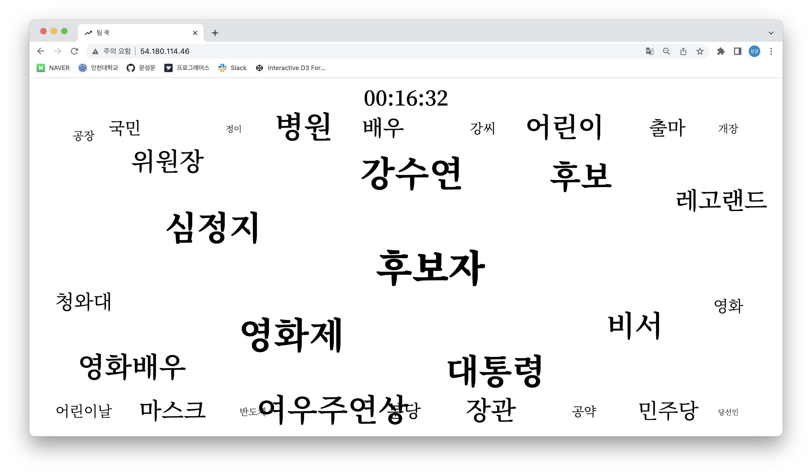
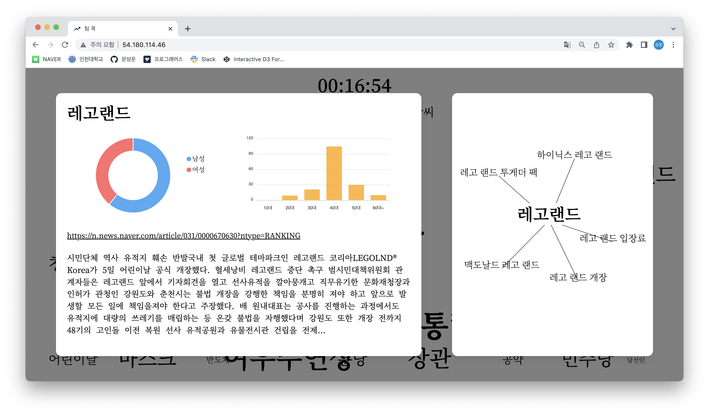

# 인천대학교 캡스톤 디자인

## 개요

- 실시간으로 이슈 된 키워드의 상세한 정보를 한눈에 확인할 수 있는 서비스
- 구두 발표로 선정 및 장려상 수상
- 프론트엔드 파트의 모든 개발과 배포를 담당

## 기술 스택

- React.js
- Typescript
- React Query
- Recoil
- D3.js
  - https://codepen.io/vialito/pen/RympKp
  - 클래스형 컴포넌트로 구현된 해당 예제 코드를 함수형 컴포넌트로 변경하여 사용

## 리팩터링

- 이전 코드 : https://github.com/corgi-world/inu-team-cook-client
- 학기 중에 학업과 병행 문제로... 시간에 쫓기듯 개발하여...
- 코드의 품질이 만족스럽지 못해 처음부터 다시 개발하였다!
